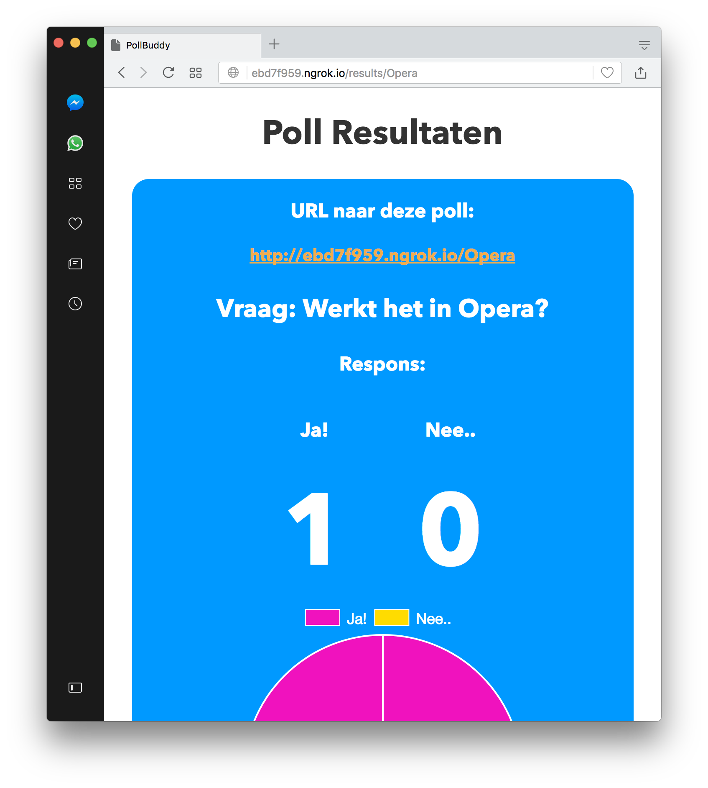
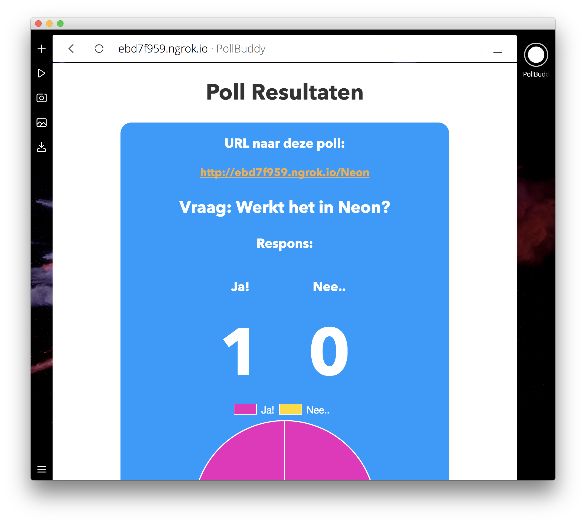

# Browser Technologies - PollBuddy


## About
This repo contains a progressively enhanced web app for the Browser Technologies course. The assignment was to create a simple demo application to practice and show how progressive enhancement for the web works. The first version of my attempt at this assignment was a simple page that shows a search field to search for contacts.

In this version I took it a bit further (and different) and made a fun little app with which you can create a real-time poll.

## User Story
The user story for this app is that a teacher wants to create a poll amongst his or her students, share the link and display the results live on screen.

## Core functionality
The main functionality of this app is to create a poll and send the link to others for them to answer the poll.


## Usability
All input elements have hover states, focus states and active states. This improves UX by a lot for users that depend on navigating with a keyboard only. One could tab one's way though the application and still use it perfectly fine.


The forms have been made as semantic as possible for optimal screen reader usage.

The user story states that a teacher wants to be able to use it. Since there are cases where schools only allow Internet Explorer, it is essential that the app works on those browsers.

When Javascript is disabled, a message is shown:


This message is created by making it show on default, but removing it with Javascript. If JS is disabled, the element is not removed.

```javascript
// Remove the No Javascript message when JS is enabled. 
// Using innerHTML is supported on all browsers, even older IE versions.

form.noscriptWarning.innerHTML = "";
```

## How it's done
The app functionality is built upon Websockets. Using Socket.io it is possible to send data and show any changes real-time in an overview page.
Socket.io is somewhat of an industry standard when it comes to websockets and is widely used. On top of that, Socket.io has good browser support. I even managed to get it to work in Internet Explorer 8.

The chart is made with ChartJS, a handy little library that is useful for all kinds of charts and is easy to implement, has great cross-browser support and looks good out of the box.

Most of the logic is rendered server-side, ensuring better support (and performance) across platforms and browsers. However, some essential code is needed on the client side.
All markup has been checked for support and whenever it is absent, a small fallback is used.

Styling is done with Flexbox where possible and fallbacks for non-flexbox browsers are present.

## Special Technologies/Enhancements used
- Flexbox
- Socket.io
- Chart.js

### Fallbacks
#### Flexbox
Fallbacks, or rather enhancements, for flexbox are needed for Internet Explorer 8 and below since these do not support it. For this, I styled the entire app in IE8 first, making sure it provides a basic visual interface and accompanying user experience. After this, I enhanced the visuals with some extra pazazz for the modern browsers.

The app's use of flexbox is mostly to center items on screen with fewer lines of code, so the enhancements are relatively easy to do.

```CSS
@supports (display:flex) {
  main {
    display: flex;
    flex-direction: column;
    flex-wrap: wrap;
    align-items: center;
  }
  form {
    margin: 1em 2em;
    display: flex;
    flex-direction: column;
    justify-content: center;
    align-items: center;
    flex-wrap: wrap;
  }
  .field-container {
    display: flex;
    flex-direction: column;
    align-items: center;
    justify-content: center;
  }
}
```
The ```@supports``` check is great! It checks if ```display:flex``` is supported. If so, override the styles according to the rules within it. This means that if there is no flexbox support, all previous stated style rules stay applied, not breaking the design.

#### Client-side Javascript
Extra care was taken to not use certain JS features that are not supported by at IE8, or provide the proprietary technology for it. The eventListener is a good example:

```Javascript  
if (!document.addEventListener) {
    form.answer1.attachEvent('onclick', function() {
      app.sendAnswer1();
    });
    form.answer2.attachEvent('onclick', function() {
      app.sendAnswer2();
    });
  } else {
    form.answer1.addEventListener('click', function() {
      console.log('Antwoord 1 versturen');
      app.sendAnswer1();
    });
    form.answer2.addEventListener('click', function() {
      console.log('Antwoord 2 versturen');
      app.sendAnswer2();
    });
  }
```
Here I check if the eventListener is or is not present. If it isn't, use Microsoft's own ```attachEvent``` method.

Another example of a fallback is a redirect. Here I did use a browser sniffing method for selfeducational purposes.

```javascript
redirect: function () {
  var userAgent = navigator.userAgent.toLowerCase(),
  isIE          = userAgent.indexOf('msie') !== -1,
  version       = parseInt(userAgent.substr(4, 2), 10),
  formID        = form.answerForm.getAttribute('data-name'),
  url           = '/thankyou';

  // Internet Explorer 8 and lower
  if (isIE && version < 9) {
      var link = document.createElement('a');
      link.href = url;
      document.body.appendChild(link);
      link.click();
  }

  // All other browsers can use the standard window.location.href
  else {
      window.location.href = url
  }
}
```
The script basically creates a link to the page we want to redirect to and then clicks it.
Other browsers will just use the standard ```window.location.href```.
#### Chart.js


Because Chart.js is not supported by IE8 (because of methods used that were not available), I have built a fallback for it to not load it in the script. Since I also provide a numerical overview that is real-time as well, it is just an enhancement that could be degraded gracefully.

```Javascript
var resultsChart;
var updateChart;

if (document.addEventListener) {
  resultsChart = new Chart(ctx,{
      type: 'pie',
      data: chartData,
      options: {
        legend: {
          labels: {
              fontColor: "white",
              fontSize: 18,
          }
        }
      }
  });
  updateChart = function(i, resultcounter) {
    chartData.datasets[0].data[i] = resultcounter;
    resultsChart.update();
    console.log('Chart updated');
  }
} else {
  updateChart = function(){
    console.log('No chart supported, skipped loading');
  }
}
```
By checking if eventlistener is or is not supported, we can sniff out if IE8 is being used, or another browser that has no support for Chart.js' essentials.
This method is advised by Microsoft's Developer Network as they feel Feature Detection is better than Browser Sniffing.

Source: https://developer.mozilla.org/en-US/docs/Learn/Tools_and_testing/Cross_browser_testing/Feature_detection
## Browser Support
The app has been tested for support on the following browsers:
- Google Chrome
- Mozilla Firefox
- Apple Safari
- Opera
- Opera Neon
- Microsoft Internet Explorer 8
- Microsoft Internet Explorer 9+

Going any lower than IE8 would be very difficult due to the app being bound to Socket.io.

### Browsers

#### Chrome


#### Firefox


#### Safari


#### Opera


#### Neon (experimental)


#### Internet Explorer 8
Submitting the answer works perfectly fine. Thank you, Socket.io!

As you can see, no chart is loaded on unsupported browsers.


#### Internet Explorer 9
Of course IE9 works then too. Even including fancy chart!


### Known issues and unsupported features
When Javascript is not enabled/supported, the app will not work. This is due to Socket.io's depencency on Javascript. Is is not possible to create a real-time app without Javascript at this point in time and therefore a well considered choice has been made to require it for the app's use.

#### Interesting quirks
A funny little thing that I encountered is that ```console.log(message)``` does not work in IE8 and IE9 when the developer tools are not open. That means that the app could potentially crash on lines that have these. I solved this issue by placing a piece of code in the script that checks if the console object is present:

```Javascript
if (typeof console == "undefined") console = {
    log: function() {},
    debug: function() {},
    error: function() {}
};
```
I found this solution at: https://stackoverflow.com/questions/27953823/console-is-undefined-error-in-ie8

## Dependencies
* Body Parser
* EJS
* Express
* Socket.io

## Usage

In terminal:

1.  Navigate to directory
2.  Install depencencies with

```
npm install
```

3. Run app with
```
node server.js
```
or, if you use Nodemon:
```
nodemon server.js
```

4. Test app at:
```
http://localhost:8080
```
